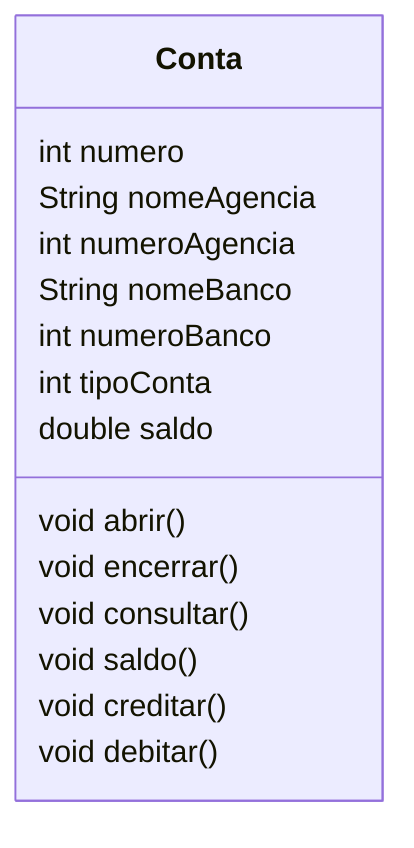

# conta-poo
Algoritmos em java usados na aulas

Crie um diagrama de classe que represente um sistema de controle de contas correntes bancárias de um correntista.

- Conta: porque seriam movimentadas uma ou várias contas. Para isso, serão necessários os seguintes dados (número, banco, saldo, etc.) para realizar operações de crédito, débito, entre outras operações bancárias nas contas. 
- Banco: porque poderia ter um ou mais bancos a quem essas contas pertencessem.
- Correntista: porque toda conta pertence a uma pessoa no mundo real e geralmente têm atrelado a elas seus dados (nome, endereço, fone, documento de identidade, CPF, etc.).

Xavier, Gley Fabiano Cardoso
Lógica de programação
E-book. Disponível em: https://bibliotecadigitalsenac.com.br/?from=%3FcontentInfo%3D1306#/legacy/epub/1306
Acesso em 12/05/2023
